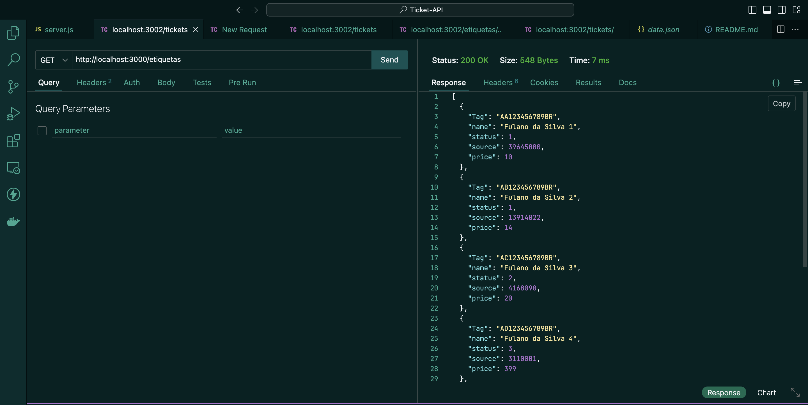
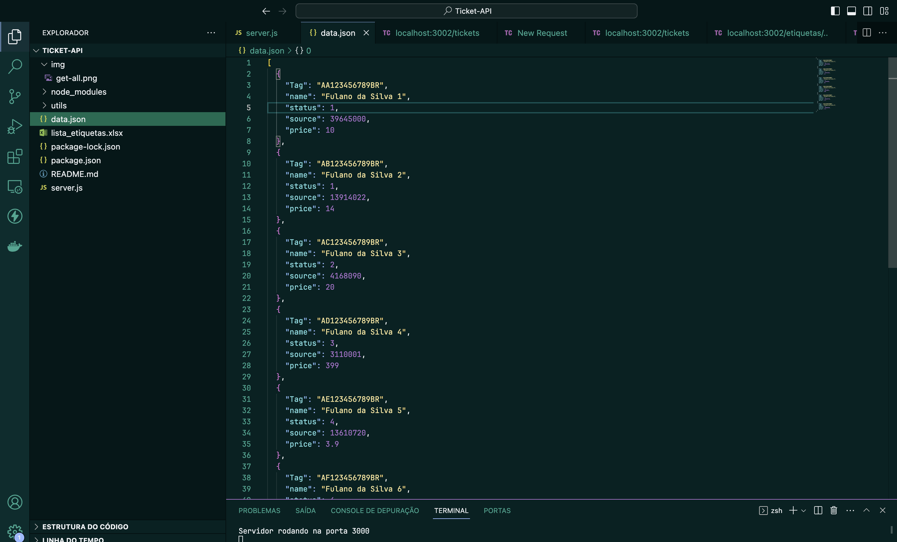
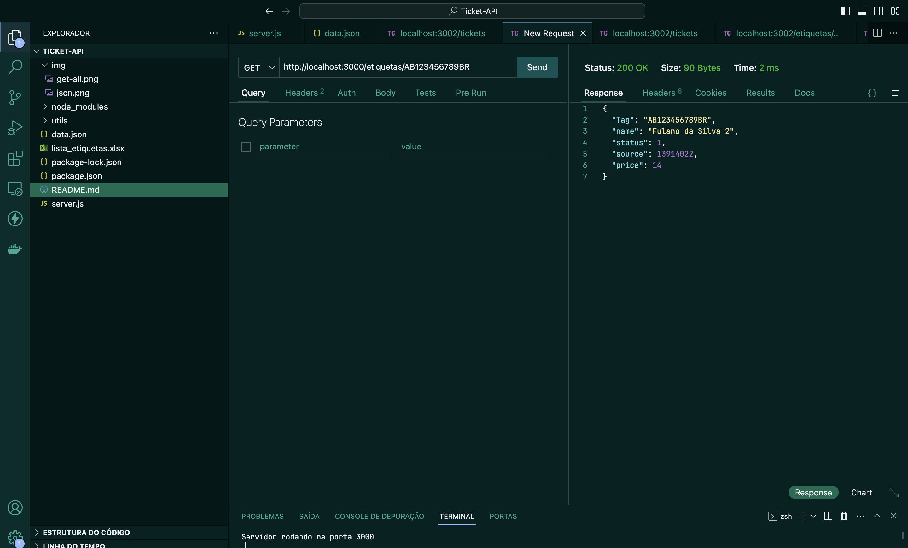
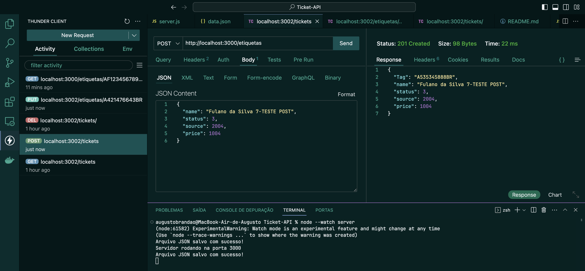
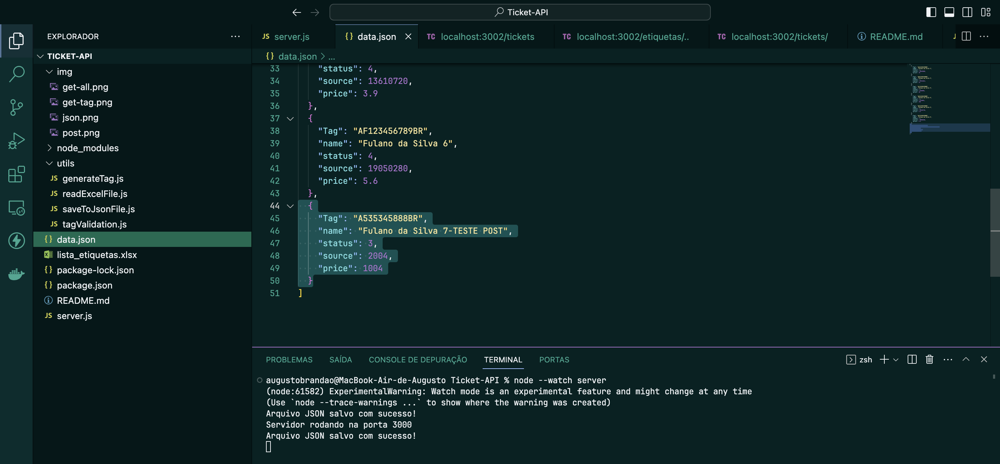
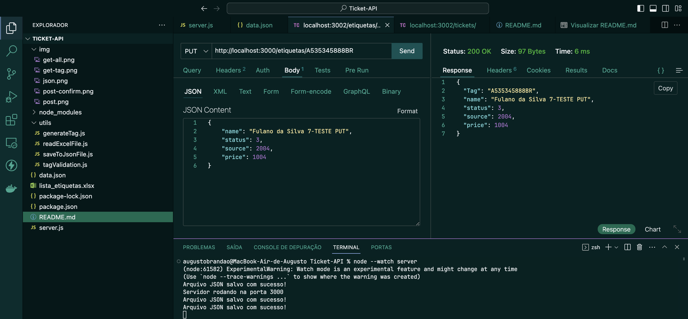
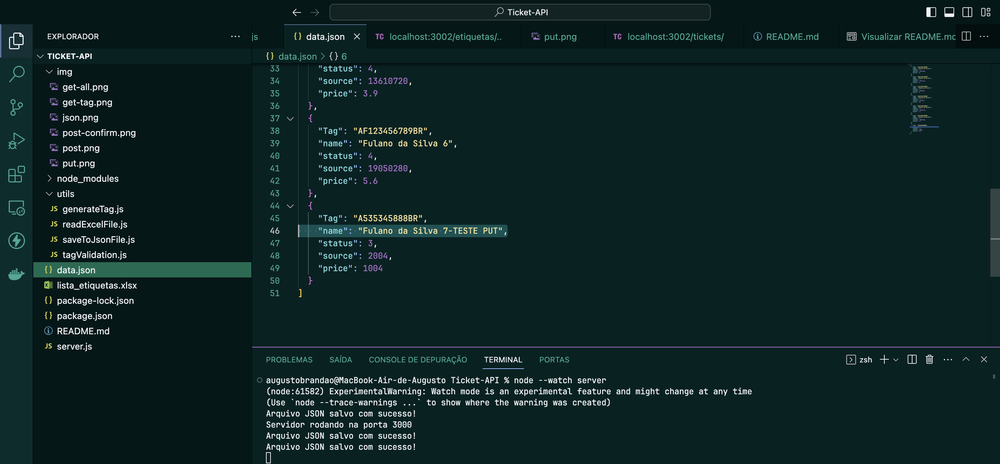
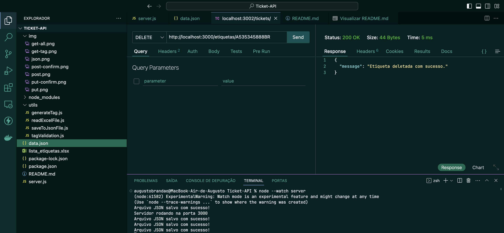

# PROJETO API-ETIQUETAS
- As etiquetas da tabela Excel são transformadas em um array de objetos
- Esse array de objetos se transforma em um arquivo JSON (o arquivo data.json é criado automaticamente a partir da tabela Excel)
- Neste projeto, é possível:
    - Realizar um GET de todas as etiquetas
    - Realizar um GET de uma etiqueta a partir de uma TAG específica
    - Realizar um POST de uma nova etiqueta
    - Realizar um PUT (edição) de uma etiqueta existente 
    - Realizar um DELETE de uma etiqueta existente 

- Esse projeto utiliza as seguintes tecnologias:
    - Node JS
    - Express
    - Manipulação de arquivo JSON
    - API Rest

### Rodar o Projeto
```npm install``` Instalar todas as dependências </br> 
```node server.js``` Execução do projeto </br>
```node --watch server.js``` Atualização automática do projeto

## REALIZANDO GET DE TODAS AS ETIQUETAS
Utilizando o Thunder Client e conectando à porta 3000, basta realizar o seguinte GET:
</br>
</br>

</br>
Se obsevar, o diretório data.json será criado contendo todos os itens da planília Excel
</br>
</br>


## REALIZANDO UM GET A PARTIR DE UMA TAG ESPECÍFICA


## REALIZAR O POST DE UMA NOVA ETIQUETA

</br>
</br>
- VALIDAÇÕES:</br>
    - O campo name deve ter pelo menos 3 caracteres</br>
    - Status deve ser um número entre 1 e 5</br>
    - O campo source deve ser maior que 1 </br>
    - Price deve ser um número positivo</br>
</br>
</br>


## REALIZAR O PUT (EDIÇÃO) DE UMA ETIQUETA EXISTENTE

</br>
</br>


## REALIZAR O DELETE (EXCLUSÃO) DE UMA ETIQUETA EXISTENTE

</br>
</br>
